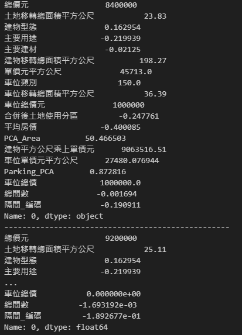

# 智能所-Machine Learning Lab1-台灣房價預測回歸模型
## Author：國立陽明交通大學 資訊管理與財務金融學系財務金融所碩一 313707043 翁智宏

本次是機器學習第一次作業，是拿台灣真實房價的資料來去訓練一個模型，然後透過公開的房屋成交價來去預測準確的對應價格。  

參考資料：[點擊這裡](https://plvr.land.moi.gov.tw/Index) 內政部不動產成交案件實際資訊資料供應系統。  

Kaggle Competition：[點擊這裡](https://plvr.land.moi.gov.tw/Index) 競賽連結

最終成績如下所示：


> 誤差在 10 萬上下
---

## 任務說明

1. **全台房價統計分析**  
   對各主要城市（如台北市、新竹市等）進行房價數據的統計分析。

2. **建立房價預測模型**  
   使用 `train.xlsx` 和 `valid.xlsx` 中的數據進行模型訓練，數據包含每筆房屋交易的記錄（包括 `id`、`price` 及多種房屋參數）。

3. **進行房價預測**  
   將 `test.xlsx` 中的房屋參數代入訓練好的模型，預測其房價。

4. **提交預測結果**  
   上傳預測結果至系統（從 “Submit Predictions” 連結）。  
   系統將計算 Mean Absolute Error（MAE），評估預測房價與實際房價的平均絕對差距。

5. **優化模型**  
   若 MAE 分數不夠理想，嘗試改進模型，提升預測準確度。

---

## 安裝依賴

請使用以下指令安裝本專案所需的依賴套件：

```bash
# 基本套件
!pip install numpy
!pip install matplotlib
!pip install pandas
!pip install openpyxl
!pip install scikit-learn
!pip install seaborn

# 深度學習框架
!pip install tensorflow
!pip install torch

# 載入部分模型
!pip install xgboost
!pip install lightgbm
!pip install catboost
```

---
## 實作

### 第一步：資料預處理
#### 1. 載入數據集
```python
import numpy as np
import matplotlib.pyplot as plt
import pandas as pd
import warnings
warnings.filterwarnings("ignore")

# Importing the dataset
df_train = pd.read_excel('Data/train.xlsx')
df_valid = pd.read_excel('Data/valid.xlsx')
df_test = pd.read_excel('Data/test-reindex-test.xlsx')
```

#### 2. 重新調整train、valid資料集比例(80/20)
```python
df_all = pd.concat([df_train, df_valid], axis=0)
df_all = df_all.sample(frac=1, random_state=42).reset_index(drop=True)

df_valid_ratio = 0.2
df_valid_size = int(len(df_all) * df_valid_ratio)

df_train = df_all[:-df_valid_size]
df_valid = df_all[-df_valid_size:]
```

#### 3. 先找出所有特徵跟總價元之間的關聯性
```python
import pandas as pd
import numpy as np
import seaborn as sns
import matplotlib.pyplot as plt
from matplotlib import rcParams

rcParams['font.family'] = 'Microsoft YaHei'  
rcParams['axes.unicode_minus'] = False  

def remove_outliers_zscore(df, column, threshold=3):
    mean = df[column].mean()
    std = df[column].std()
    df_clean = df[(np.abs((df[column] - mean) / std) <= threshold)]
    return df_clean

def scatterplot(feature, df, ax):
    df_copy = df.copy()
    pd.set_option('display.float_format', lambda x: '{:.2f}'.format(x))
    sns.set_style('darkgrid')

    df_copy[feature] = pd.to_numeric(df_copy[feature], errors='coerce')
    df_copy.dropna(subset=[feature, '總價元'], inplace=True)

    sns.scatterplot(x=df_copy[feature], y=df_copy['總價元'], alpha=0.5, ax=ax)
    ax.set_title(f'{feature} 與 總價元 的散佈圖', fontsize=10)
    ax.set_xlabel(feature)
    ax.set_ylabel('總價元')

# 設置子圖的網格大小
rows = 3  # 每行顯示的散佈圖數量
cols = 3  # 每頁顯示的行數

features = [
    '土地移轉總面積平方公尺', '交易筆棟數', '總樓層數', '建物現況格局-房', '建物現況格局-廳', 
    '建物現況格局-衛', '單價元平方公尺', '車位移轉總面積平方公尺', '車位總價元'
]

fig, axes = plt.subplots(nrows=rows, ncols=cols, figsize=(15, 12))
fig.tight_layout(pad=3.0)

for i, feature in enumerate(features):
    row = i // cols
    col = i % cols
    try:
        print(f"繪製 {feature} 與 總價元 的散佈圖")
        scatterplot(feature, df_train, axes[row, col])
    except Exception as e:
        print(f"{feature} 特徵無法繪製散佈圖，錯誤原因：{e}")

plt.show()
```
> 圖中的中文字編碼有誤，順序由左至右由上至下分別是  
('土地移轉總面積平方公尺', '交易筆棟數', '總樓層數', '建物現況格局-房', '建物現況格局-廳',  
'建物現況格局-衛', '單價元平方公尺', '車位移轉總面積平方公尺', '車位總價元')


#### 4. 刪除掉raw data中有"main use"的row(rawdata中有一行亂碼)
`df_train = df_train[~df_train['主要用途'].str.contains("main use", na=False)]`

#### 5. 刪除不重要的特徵
```python
df_train = df_train.drop(['編號', '解約情形', '棟及號', '交易標的','移轉層次','總樓層數', '非都市土地使用編定' , '有無管理組織' ,'備註', '建案名稱', '建築完成年月', '交易年月日'], axis=1)
df_valid = df_valid.drop(['編號', '解約情形', '棟及號', '交易標的','移轉層次','總樓層數', '非都市土地使用編定' , '有無管理組織' ,'備註', '建案名稱', '建築完成年月', '交易年月日'], axis=1)
df_test = df_test.drop(['編號', '解約情形', '棟及號', '交易標的','移轉層次','總樓層數', '非都市土地使用編定' , '有無管理組織' ,'備註', '建案名稱', '建築完成年月', '交易年月日'], axis=1)
df_train = df_train.drop(['鄉鎮市區'], axis=1)
df_valid = df_valid.drop(['鄉鎮市區'], axis=1)
df_test = df_test.drop(['鄉鎮市區'], axis=1)
print(df_train.columns.tolist())
print(df_train.dtypes)
```


#### 6. 刪除離群值
```python
df_train = df_train[df_train['土地移轉總面積平方公尺'] < 8000]
df_train = df_train[df_train['建物移轉總面積平方公尺'] < 15000] #
df_train = df_train[df_train['車位移轉總面積平方公尺'] < 4000]
df_train = df_train[df_train['車位總價元'] < 14000000]

# 檢查結果
print("訓練集 rows:", len(df_train))
print("驗證集 rows:", len(df_valid))
```


#### 7. 處理空值
```python
# 合併土地使用分區，然後空值填0
df_train['合併後土地使用分區'] = df_train['都市土地使用分區'].combine_first(df_train['非都市土地使用分區']).fillna('其他')
df_valid['合併後土地使用分區'] = df_valid['都市土地使用分區'].combine_first(df_valid['非都市土地使用分區']).fillna('其他')
df_test['合併後土地使用分區'] = df_test['都市土地使用分區'].combine_first(df_test['非都市土地使用分區']).fillna('其他')

# 將主要用途填滿
def fill_main_usage(df):
    conditions = [
        (df['合併後土地使用分區'] == '住'),
        (df['合併後土地使用分區'].isin(['商', '工'])),
        (df['合併後土地使用分區'] == '農'),
        (df['合併後土地使用分區'] == '其他'),
        (df['合併後土地使用分區'] == '工業區'),
        (df['合併後土地使用分區'] == '鄉村區')
    ]
    choices = ['住家用', '工商用','農業用', '工商用', '工業用', '住家用']   
    fill_values = pd.Series(np.select(conditions, choices, default=df['主要用途']), index=df.index)
    df['主要用途'] = df['主要用途'].combine_first(fill_values)
   
    return df

df_train = fill_main_usage(df_train)
df_valid = fill_main_usage(df_valid)
df_test = fill_main_usage(df_test)

df_train = df_train.drop(['都市土地使用分區', '非都市土地使用分區'], axis=1)
df_valid = df_valid.drop(['都市土地使用分區', '非都市土地使用分區'], axis=1)
df_test = df_test.drop(['都市土地使用分區', '非都市土地使用分區'], axis=1)

df_train[['土地移轉總面積平方公尺', '建物移轉總面積平方公尺']] = df_train[['土地移轉總面積平方公尺', '建物移轉總面積平方公尺']].fillna(df_train[['土地移轉總面積平方公尺', '建物移轉總面積平方公尺']].mean())
df_valid[['土地移轉總面積平方公尺', '建物移轉總面積平方公尺']] = df_valid[['土地移轉總面積平方公尺', '建物移轉總面積平方公尺']].fillna(df_valid[['土地移轉總面積平方公尺', '建物移轉總面積平方公尺']].mean())
df_test[['土地移轉總面積平方公尺', '建物移轉總面積平方公尺']] = df_test[['土地移轉總面積平方公尺', '建物移轉總面積平方公尺']].fillna(df_test[['土地移轉總面積平方公尺', '建物移轉總面積平方公尺']].mean())


df_train['單價元平方公尺'] = df_train['單價元平方公尺'].fillna(df_train['單價元平方公尺'].mean())
df_valid['單價元平方公尺'] = df_valid['單價元平方公尺'].fillna(df_valid['單價元平方公尺'].mean())
df_test['單價元平方公尺'] = df_test['單價元平方公尺'].fillna(df_test['單價元平方公尺'].mean())


# 將主要建材空值填0
df_train = df_train.dropna(subset=['主要建材'])
df_valid = df_valid.dropna(subset=['主要建材'])
df_test['主要建材'] = df_test['主要建材'].fillna("見使用執照")


# 將車位類別空值填0
df_train['車位類別'] = df_train['車位類別'].fillna("無")
df_valid['車位類別'] = df_valid['車位類別'].fillna("無")
df_test['車位類別'] = df_test['車位類別'].fillna("無")


# 將建物現況格局空值填0
for col in ['建物現況格局-房', '建物現況格局-廳', '建物現況格局-衛']:
    median_value = df_train[col].median()
    df_train[col].fillna(0, inplace=True)
    df_valid[col].fillna(0, inplace=True)
    df_test[col].fillna(0, inplace=True)
```

### 第二步：資料編碼
#### 1. 針對 縣市進行 label embedding
```python
from sklearn.preprocessing import StandardScaler

city_to_price = {
    '臺北市': 217000,  
    '台北市': 217000,  
    '新北市': 70000,   
    '新竹市': 40000,  
    '新竹縣': 36000,   
    '基隆市': 30000,  
    '桃園市': 30000,   
    '桃園縣': 30000,   
    '臺中市': 32000,   
    '台中市': 32000,   
    '高雄市': 25000,   
    '臺南市': 25000,   
    '台南市': 25000,
    '彰化縣': 20000,   
    '苗栗縣': 22000,   
    '南投縣': 20000,   
    '嘉義市': 22000,  
    '嘉義縣': 20000,   
    '宜蘭縣': 22000,  
    '雲林縣': 20000,  
    '屏東縣': 20000, 
    '花蓮縣': 18000, 
    '臺東縣': 18000,   
    '金門縣': 18000,
    '澎湖縣': 19000,  
}

# 提取 "土地位置建物門牌" 的前面三個字作為 "縣市"
df_train['縣市'] = df_train['土地位置建物門牌'].str[:3]
df_valid['縣市'] = df_valid['土地位置建物門牌'].str[:3]
df_test['縣市'] = df_test['土地位置建物門牌'].str[:3]

# 只保留那些 "縣市" 是 city_to_price 字典中的資料，其他捨棄
df_train = df_train[df_train['縣市'].isin(city_to_price.keys())]
df_valid = df_valid[df_valid['縣市'].isin(city_to_price.keys())]
df_test = df_test[df_test['縣市'].isin(city_to_price.keys())]

# 將 "縣市" 欄位替換成對應的平均房價
df_train['平均房價'] = df_train['縣市'].replace(city_to_price)
df_valid['平均房價'] = df_valid['縣市'].replace(city_to_price)
df_test['平均房價'] = df_test['縣市'].replace(city_to_price)


scaler = StandardScaler()

features_train = df_train[['平均房價']]
scaled_features_train = scaler.fit_transform(features_train)
df_train['平均房價'] = scaled_features_train[:, 0]

features_valid = df_valid[['平均房價']]
scaled_features_valid = scaler.transform(features_valid)
df_valid['平均房價'] = scaled_features_valid[:, 0]

features_test = df_test[['平均房價']]
scaled_features_test = scaler.transform(features_test)
df_test['平均房價'] = scaled_features_test[:, 0]


df_train = df_train.drop(['土地位置建物門牌', '縣市'], axis=1)
df_valid = df_valid.drop(['土地位置建物門牌', '縣市'], axis=1)
df_test = df_test.drop(['土地位置建物門牌', '縣市'], axis=1)

print(df_train.columns[:])
```

#### 2. 針對 移轉樓層和總樓層 進行 label embedding、'土地移轉總面積平方公尺', '建物移轉總面積平方公尺'進行PCA降維合併
```python
from sklearn.decomposition import PCA
from sklearn.preprocessing import LabelEncoder

pca = PCA(n_components=1)

area_features_train = df_train[['土地移轉總面積平方公尺', '建物移轉總面積平方公尺','車位移轉總面積平方公尺']]
pca_train_features = pca.fit_transform(area_features_train)
df_train['PCA_Area'] = pca_train_features

area_features_valid = df_valid[['土地移轉總面積平方公尺', '建物移轉總面積平方公尺','車位移轉總面積平方公尺']]
pca_valid_features = pca.transform(area_features_valid)
df_valid['PCA_Area'] = pca_valid_features

area_features_test = df_test[['土地移轉總面積平方公尺', '建物移轉總面積平方公尺','車位移轉總面積平方公尺']]
pca_test_features = pca.transform(area_features_test)
df_test['PCA_Area'] = pca_test_features
```

#### 3. 生成一個新特徵 土地移轉總面積平方公尺*單價元平方公尺 和 建物平方公尺乘上單價元
```python
df_train['建物平方公尺乘上單價元'] = df_train['建物移轉總面積平方公尺'] * df_train['單價元平方公尺']
df_valid['建物平方公尺乘上單價元'] = df_valid['建物移轉總面積平方公尺'] * df_valid['單價元平方公尺']
df_test['建物平方公尺乘上單價元'] = df_test['建物移轉總面積平方公尺'] * df_test['單價元平方公尺']
```

#### 4. 針對 主要用途 進行 label embedding
```python
use_to_price = {
    '住家用': 60000,     # 住家用房屋的平均房價
    '商業用': 90000,     # 商業用房屋的平均房價
    '住商用': 75000,     # 住商混合用途的平均房價
    '工商用': 70000,     # 工商用房屋的平均房價
    '工業用': 50000,     # 工業用房屋的平均房價
    '住工用': 55000,     # 住工混合用途的平均房價
    '國民住宅': 35000,   # 國民住宅的平均房價
    '停車空間': 20000,   # 停車空間的平均價格
    '農業用': 15000,     # 農業用地的平均價格
    '見使用執照': 60000,  # 需參考使用執照的房價
    '見其他登記事項': 60000,  # 需參考其他登記事項的房價
    '見其它登記事項': 60000,  # 同上
}

# 1. 將訓練集中的「主要用途」替換為對應的價格
df_train['主要用途'] = df_train['主要用途'].replace(use_to_price)
df_train['主要用途'] = df_train['主要用途'].fillna(np.mean(list(use_to_price.values())))

# 將「主要用途」進行標準化
scaler = StandardScaler()
df_train[['主要用途']] = scaler.fit_transform(df_train[['主要用途']])


# 2. 將驗證集中的「主要用途」替換為對應的價格
df_valid['主要用途'] = df_valid['主要用途'].replace(use_to_price)
df_valid['主要用途'] = df_valid['主要用途'].fillna(np.mean(list(use_to_price.values())))

# 將「主要用途」進行標準化
df_valid[['主要用途']] = scaler.transform(df_valid[['主要用途']])


# 3. 將測試集中的「主要用途」替換為對應的價格
df_test['主要用途'] = df_test['主要用途'].replace(use_to_price)
df_test['主要用途'] = df_test['主要用途'].fillna(np.mean(list(use_to_price.values())))

# 將「主要用途」進行標準化
df_test[['主要用途']] = scaler.transform(df_test[['主要用途']])
```

#### 5. 針對 主要建材 進行 label embedding
```python
material_to_price = {
    '鋼筋混凝土造': 50.0,
    '鋼筋混凝土構造': 50.0,
    '鋼骨混凝土造': 55.0,
    '鋼骨鋼筋混凝土造': 60.0,
    '鋼筋混凝土加強磚造': 45.0,
    '混凝土造': 40.0,
    '鋼造': 35.0,
    '磚造': 30.0,
    '預力混凝土造': 42.0,
    '石造': 28.0,
    '木造': 25.0,
    '見使用執照': 40.0,  
    '見其他登記事項': 40.0,
    '見其它登記事項': 40.0,  
}

# 1. 替換訓練集中的「主要建材」為對應的價格
df_train['主要建材'] = df_train['主要建材'].replace(material_to_price)
df_train['主要建材'] = df_train['主要建材'].fillna(np.mean(list(material_to_price.values())))

# 將「主要建材」進行標準化
scaler = StandardScaler()
df_train[['主要建材']] = scaler.fit_transform(df_train[['主要建材']])

# 2. 替換驗證集中的「主要建材」為對應的價格
df_valid['主要建材'] = df_valid['主要建材'].replace(material_to_price)
df_valid['主要建材'] = df_valid['主要建材'].fillna(np.mean(list(material_to_price.values())))

# 將「主要建材」進行標準化
df_valid[['主要建材']] = scaler.transform(df_valid[['主要建材']])


# 3. 替換測試集中的「主要建材」為對應的價格
df_test['主要建材'] = df_test['主要建材'].replace(material_to_price)
df_test['主要建材'] = df_test['主要建材'].fillna(np.mean(list(material_to_price.values())))

# 將「主要建材」進行標準化
df_test[['主要建材']] = scaler.transform(df_test[['主要建材']])
```

#### 6. 針對 建物型態 進行 label embedding
```python
type_to_price = {
    '住宅大樓(11層含以上有電梯)': 50.0,
    '華廈(10層含以下有電梯)': 45.0,
    '店面(店鋪)': 100.0,
    '辦公商業大樓': 80.0,
    '公寓(5樓含以下無電梯)': 35.0,
    '透天厝': 30.0,
    '廠辦': 40.0,
    '工廠': 35.0,
    '套房(1房1廳1衛)': 40.0,
    '倉庫': 30.0,
    '農舍': 20.0,
    '其他': 40.0,
}

df_train['建物型態'] = df_train['建物型態'].replace(type_to_price)
df_train['建物型態'] = df_train['建物型態'].fillna(np.mean(list(type_to_price.values())))

# 將「建物型態」進行標準化
scaler = StandardScaler()
df_train[['建物型態']] = scaler.fit_transform(df_train[['建物型態']])

# 2. 替換驗證集中的「建物型態」為對應的價格
df_valid['建物型態'] = df_valid['建物型態'].replace(type_to_price)
df_valid['建物型態'] = df_valid['建物型態'].fillna(np.mean(list(type_to_price.values())))

# 使用與訓練集相同的 scaler 進行標準化
df_valid[['建物型態']] = scaler.transform(df_valid[['建物型態']])


# 3. 替換測試集中的「建物型態」為對應的價格
df_test['建物型態'] = df_test['建物型態'].replace(type_to_price)
df_test['建物型態'] = df_test['建物型態'].fillna(np.mean(list(type_to_price.values())))

# 使用與訓練集相同的 scaler 進行標準化
df_test[['建物型態']] = scaler.transform(df_test[['建物型態']])
```

#### 7. 針對 車位類別 進行 label embedding、再對車位屬性進行PCA降維
```python
parking_type_to_price = {
    '坡道平面': 150.0,
    '塔式車位': 80.0,
    '坡道機械': 100.0,
    '升降機械': 70.0,
    '升降平面': 90.0,
    '一樓平面': 200.0,
    '其他': 100.0,
    '無': 0.0,
}

# 定義處理函數
def process_parking_features(df):
    # 替換車位類別為對應的價格
    average_price = np.mean(list(parking_type_to_price.values()))
    df['車位類別'] = df['車位類別'].replace(parking_type_to_price)
    df['車位類別'] = df['車位類別'].fillna(average_price)

    # 處理缺失值
    df['車位移轉總面積平方公尺'] = df['車位移轉總面積平方公尺'].fillna(df['車位移轉總面積平方公尺'].median())
    df['車位總價元'] = df['車位總價元'].fillna(df['車位總價元'].median())

    # 計算車位單價（每平方公尺價格）
    df['車位單價元平方公尺'] = df['車位總價元'] / df['車位移轉總面積平方公尺']
    df['車位單價元平方公尺'] = df['車位單價元平方公尺'].replace([np.inf, -np.inf], np.nan).fillna(df['車位單價元平方公尺'].median())

    # 選擇需要進行 PCA 的特徵
    features = df[['車位類別', '車位移轉總面積平方公尺', '車位單價元平方公尺']]

    # 標準化
    scaler = StandardScaler()
    features_scaled = scaler.fit_transform(features)

    return features_scaled

parking_features_train = process_parking_features(df_train)
parking_features_valid = process_parking_features(df_valid)
parking_features_test = process_parking_features(df_test)

pca = PCA(n_components=1)
parking_pca_train = pca.fit_transform(parking_features_train)
parking_pca_valid = pca.transform(parking_features_valid)
parking_pca_test = pca.transform(parking_features_test)

# 添加 PCA 特徵到原始數據集
df_train['Parking_PCA'] = parking_pca_train
df_valid['Parking_PCA'] = parking_pca_valid
df_test['Parking_PCA'] = parking_pca_test
```

#### 8. 撈出車位數量比
```python
df_train['車位'] = df_train['交易筆棟數'].str.extract(r'車位(\d+)').astype(float)
df_valid['車位'] = df_valid['交易筆棟數'].str.extract(r'車位(\d+)').astype(float)
df_test['車位'] = df_test['交易筆棟數'].str.extract(r'車位(\d+)').astype(float)


def calculate_total_prices(df):
    df['車位'] = df['交易筆棟數'].str.extract(r'車位(\d+)').astype(float)
    df['車位總價'] = df['車位'] * df['車位總價元']

    return df

# 對訓練、驗證和測試集進行處理
df_train = calculate_total_prices(df_train)
df_valid = calculate_total_prices(df_valid)
df_test = calculate_total_prices(df_test)


df_train = df_train.drop(['交易筆棟數'], axis=1)
df_valid = df_valid.drop(['交易筆棟數'], axis=1)
df_test = df_test.drop(['交易筆棟數'], axis=1)

df_train = df_train.drop(['車位'], axis=1)
df_valid = df_valid.drop(['車位'], axis=1)
df_test = df_test.drop(['車位'], axis=1)
```

#### 9. 針對 都市土地使用分區 進行 label embedding
```python
zone_to_price = {
    '住': 50.0,        
    '商': 80.0,        
    '工': 30.0,        
    '農': 15.0,        
    '其他': 45.0,      
    '山坡地保育區': 20.0,  
    '特定農業區': 15.0,    
    '鄉村區': 25.0,      
    '一般農業區': 15.0,  
    '工業區': 30.0,     
    '特定專用區': 40.0,  
    '風景區': 60.0      
}

df_train['合併後土地使用分區'] = df_train['合併後土地使用分區'].replace(zone_to_price)
df_train['合併後土地使用分區'] = df_train['合併後土地使用分區'].fillna(np.mean(list(zone_to_price.values())))

scaler = StandardScaler()
df_train[['合併後土地使用分區']] = scaler.fit_transform(df_train[['合併後土地使用分區']])

df_valid['合併後土地使用分區'] = df_valid['合併後土地使用分區'].replace(zone_to_price)
df_valid['合併後土地使用分區'] = df_valid['合併後土地使用分區'].fillna(np.mean(list(zone_to_price.values())))
df_valid[['合併後土地使用分區']] = scaler.transform(df_valid[['合併後土地使用分區']])

df_test['合併後土地使用分區'] = df_test['合併後土地使用分區'].replace(zone_to_price)
df_test['合併後土地使用分區'] = df_test['合併後土地使用分區'].fillna(np.mean(list(zone_to_price.values())))
df_test[['合併後土地使用分區']] = scaler.transform(df_test[['合併後土地使用分區']])
```

#### 10. 對 '建物現況格局-房', '建物現況格局-廳', '建物現況格局-衛' 進行加總
```python
for col in ['建物現況格局-房', '建物現況格局-廳', '建物現況格局-衛']:
    df_train[col] = pd.to_numeric(df_train[col], errors='coerce')
    df_valid[col] = pd.to_numeric(df_valid[col], errors='coerce')
    df_test[col] = pd.to_numeric(df_test[col], errors='coerce')
    
df_train['總間數'] = df_train['建物現況格局-房'] + df_train['建物現況格局-廳'] + df_train['建物現況格局-衛']
df_valid['總間數'] = df_valid['建物現況格局-房'] + df_valid['建物現況格局-廳'] + df_valid['建物現況格局-衛']
df_test['總間數'] = df_test['建物現況格局-房'] + df_test['建物現況格局-廳'] + df_test['建物現況格局-衛']

df_train = df_train.drop(['建物現況格局-房', '建物現況格局-廳', '建物現況格局-衛'], axis=1)
df_valid = df_valid.drop(['建物現況格局-房', '建物現況格局-廳', '建物現況格局-衛'], axis=1)
df_test = df_test.drop(['建物現況格局-房', '建物現況格局-廳', '建物現況格局-衛'], axis=1)

numeric_features = ['總間數']

scaler = StandardScaler()
df_train[numeric_features] = scaler.fit_transform(df_train[numeric_features])
df_valid[numeric_features] = scaler.transform(df_valid[numeric_features])
df_test[numeric_features] = scaler.transform(df_test[numeric_features])
```

#### 11. 針對 建物現況格局-隔間 進行 target encoding
```python
from sklearn.model_selection import KFold

df_combined = pd.concat([df_train, df_valid], ignore_index=True)
df_combined['隔間_編碼'] = np.nan

kf = KFold(n_splits=5, shuffle=True, random_state=42)

for train_index, val_index in kf.split(df_combined):
    df_train_fold = df_combined.iloc[train_index]
    df_val_fold = df_combined.iloc[val_index]
    target_mean = df_train_fold.groupby('建物現況格局-隔間')['總價元'].mean()
    df_combined.loc[val_index, '隔間_編碼'] = df_val_fold['建物現況格局-隔間'].map(target_mean)

overall_mean = df_combined['總價元'].mean()
df_combined['隔間_編碼'] = df_combined['隔間_編碼'].fillna(overall_mean)

scaler = StandardScaler()
df_combined['隔間_編碼'] = scaler.fit_transform(df_combined[['隔間_編碼']])

df_train = df_combined.iloc[:len(df_train)].reset_index(drop=True)
df_valid = df_combined.iloc[len(df_train):].reset_index(drop=True)


target_mean_full = df_train.groupby('建物現況格局-隔間')['總價元'].mean()
df_test['隔間_編碼'] = df_test['建物現況格局-隔間'].map(target_mean_full)
df_test['隔間_編碼'] = df_test['隔間_編碼'].fillna(overall_mean)
df_test['隔間_編碼'] = scaler.transform(df_test[['隔間_編碼']])


df_train = df_train.drop(['建物現況格局-隔間'], axis=1)
df_valid = df_valid.drop(['建物現況格局-隔間'], axis=1)
df_test = df_test.drop(['建物現況格局-隔間'], axis=1)
```

#### 12. 最後，查看目前的Raw Data中的資料型態
```python
print(df_train.iloc[0])
print("-"*50)
print(df_valid.iloc[0])
print("-"*50)   
print(df_test.iloc[0])
```


