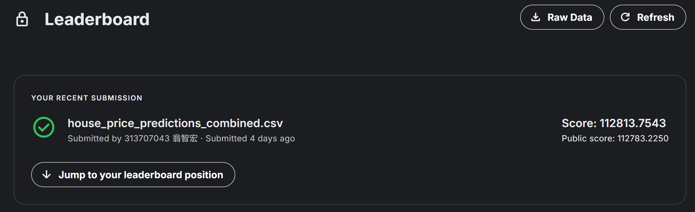
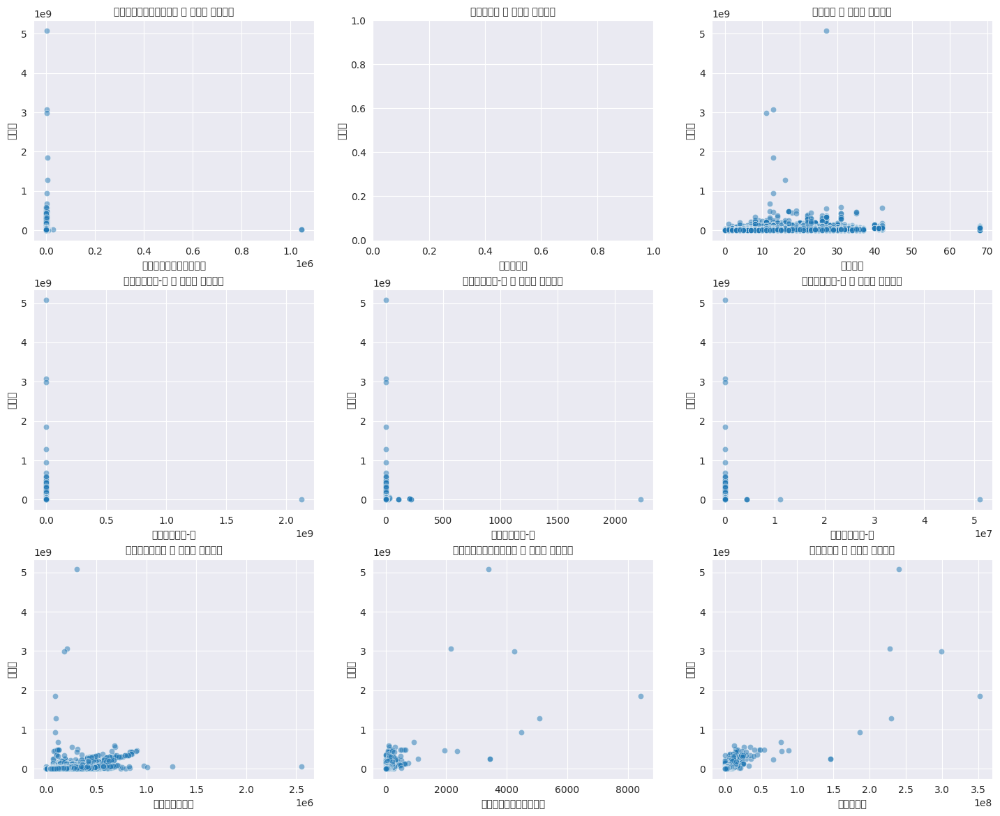
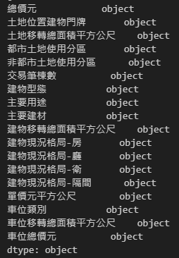
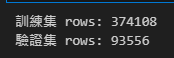

# 智能所-Machine Learning Lab1-台灣房價預測回歸模型
## Author：國立陽明交通大學 資訊管理與財務金融學系財務金融所碩一 313707043 翁智宏

本次是機器學習第一次作業，是拿台灣真實房價的資料來去訓練一個模型，然後透過公開的房屋成交價來去預測準確的對應價格。  

參考資料：[點擊這裡](https://plvr.land.moi.gov.tw/Index) 內政部不動產成交案件實際資訊資料供應系統。  

Kaggle Competition：[點擊這裡](https://plvr.land.moi.gov.tw/Index) 競賽連結

最終成績如下所示：



> 誤差在 10 萬上下
---

## 任務說明

1. **全台房價統計分析**  
   對各主要城市（如台北市、新竹市等）進行房價數據的統計分析。

2. **建立房價預測模型**  
   使用 `train.xlsx` 和 `valid.xlsx` 中的數據進行模型訓練，數據包含每筆房屋交易的記錄（包括 `id`、`price` 及多種房屋參數）。

3. **進行房價預測**  
   將 `test.xlsx` 中的房屋參數代入訓練好的模型，預測其房價。

4. **提交預測結果**  
   上傳預測結果至系統（從 “Submit Predictions” 連結）。  
   系統將計算 Mean Absolute Error（MAE），評估預測房價與實際房價的平均絕對差距。

5. **優化模型**  
   若 MAE 分數不夠理想，嘗試改進模型，提升預測準確度。

---

## 安裝依賴

請使用以下指令安裝本專案所需的依賴套件：

```bash
# 基本套件
!pip install numpy
!pip install matplotlib
!pip install pandas
!pip install openpyxl
!pip install scikit-learn
!pip install seaborn

# 深度學習框架
!pip install tensorflow
!pip install torch

# 載入部分模型
!pip install xgboost
!pip install lightgbm
!pip install catboost
```

---
## 實作

### 第一步：資料預處理
#### 1. 載入數據集
```python
import numpy as np
import matplotlib.pyplot as plt
import pandas as pd
import warnings
warnings.filterwarnings("ignore")

# Importing the dataset
df_train = pd.read_excel('Data/train.xlsx')
df_valid = pd.read_excel('Data/valid.xlsx')
df_test = pd.read_excel('Data/test-reindex-test.xlsx')
```

#### 2. 重新調整train、valid資料集比例(80/20)
```python
df_all = pd.concat([df_train, df_valid], axis=0)
df_all = df_all.sample(frac=1, random_state=42).reset_index(drop=True)

df_valid_ratio = 0.2
df_valid_size = int(len(df_all) * df_valid_ratio)

df_train = df_all[:-df_valid_size]
df_valid = df_all[-df_valid_size:]
```

#### 3. 先找出所有特徵跟總價元之間的關聯性
```python
import pandas as pd
import numpy as np
import seaborn as sns
import matplotlib.pyplot as plt
from matplotlib import rcParams

rcParams['font.family'] = 'Microsoft YaHei'  
rcParams['axes.unicode_minus'] = False  

def remove_outliers_zscore(df, column, threshold=3):
    mean = df[column].mean()
    std = df[column].std()
    df_clean = df[(np.abs((df[column] - mean) / std) <= threshold)]
    return df_clean

def scatterplot(feature, df, ax):
    df_copy = df.copy()
    pd.set_option('display.float_format', lambda x: '{:.2f}'.format(x))
    sns.set_style('darkgrid')

    df_copy[feature] = pd.to_numeric(df_copy[feature], errors='coerce')
    df_copy.dropna(subset=[feature, '總價元'], inplace=True)

    sns.scatterplot(x=df_copy[feature], y=df_copy['總價元'], alpha=0.5, ax=ax)
    ax.set_title(f'{feature} 與 總價元 的散佈圖', fontsize=10)
    ax.set_xlabel(feature)
    ax.set_ylabel('總價元')

# 設置子圖的網格大小
rows = 3  # 每行顯示的散佈圖數量
cols = 3  # 每頁顯示的行數

features = [
    '土地移轉總面積平方公尺', '交易筆棟數', '總樓層數', '建物現況格局-房', '建物現況格局-廳', 
    '建物現況格局-衛', '單價元平方公尺', '車位移轉總面積平方公尺', '車位總價元'
]

fig, axes = plt.subplots(nrows=rows, ncols=cols, figsize=(15, 12))
fig.tight_layout(pad=3.0)

for i, feature in enumerate(features):
    row = i // cols
    col = i % cols
    try:
        print(f"繪製 {feature} 與 總價元 的散佈圖")
        scatterplot(feature, df_train, axes[row, col])
    except Exception as e:
        print(f"{feature} 特徵無法繪製散佈圖，錯誤原因：{e}")

plt.show()
```
> 圖中的中文字編碼有誤，順序由左至右由上至下分別是  
('土地移轉總面積平方公尺', '交易筆棟數', '總樓層數', '建物現況格局-房', '建物現況格局-廳',  
'建物現況格局-衛', '單價元平方公尺', '車位移轉總面積平方公尺', '車位總價元')



#### 4. 刪除掉raw data中有"main use"的row(rawdata中有一行亂碼)
`df_train = df_train[~df_train['主要用途'].str.contains("main use", na=False)]`

#### 5. 刪除不重要的特徵
```python
df_train = df_train.drop(['編號', '解約情形', '棟及號', '交易標的','移轉層次','總樓層數', '非都市土地使用編定' , '有無管理組織' ,'備註', '建案名稱', '建築完成年月', '交易年月日'], axis=1)
df_valid = df_valid.drop(['編號', '解約情形', '棟及號', '交易標的','移轉層次','總樓層數', '非都市土地使用編定' , '有無管理組織' ,'備註', '建案名稱', '建築完成年月', '交易年月日'], axis=1)
df_test = df_test.drop(['編號', '解約情形', '棟及號', '交易標的','移轉層次','總樓層數', '非都市土地使用編定' , '有無管理組織' ,'備註', '建案名稱', '建築完成年月', '交易年月日'], axis=1)
df_train = df_train.drop(['鄉鎮市區'], axis=1)
df_valid = df_valid.drop(['鄉鎮市區'], axis=1)
df_test = df_test.drop(['鄉鎮市區'], axis=1)
print(df_train.columns.tolist())
print(df_train.dtypes)
```


#### 6. 刪除離群值
```python
df_train = df_train[df_train['土地移轉總面積平方公尺'] < 8000]
df_train = df_train[df_train['建物移轉總面積平方公尺'] < 15000] #
df_train = df_train[df_train['車位移轉總面積平方公尺'] < 4000]
df_train = df_train[df_train['車位總價元'] < 14000000]

# 檢查結果
print("訓練集 rows:", len(df_train))
print("驗證集 rows:", len(df_valid))
```

